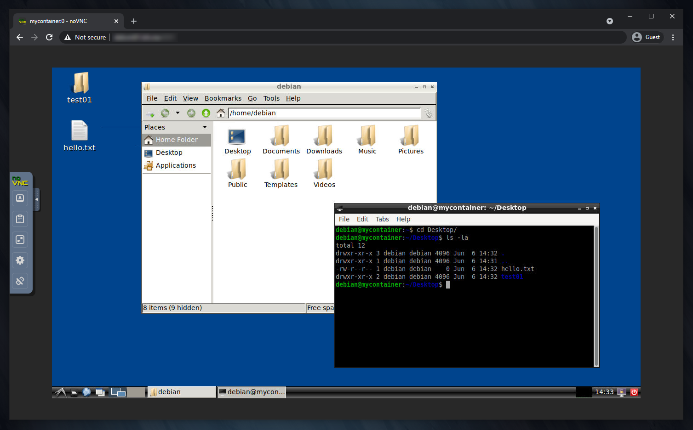

# desktainer-rootless


[](https://github.com/dmotte/desktainer-rootless/actions)
[](https://hub.docker.com/r/dmotte/desktainer-rootless)

:computer: Remote **desk**top in a con**tainer** (rootless version). This image is almost equivalent to [dmotte/desktainer](https://github.com/dmotte/desktainer) but it runs as a **non-root user**.

> :package: This image is also on **Docker Hub** as [`dmotte/desktainer-rootless`](https://hub.docker.com/r/dmotte/desktainer-rootless) and runs on **several architectures** (e.g. amd64, arm64, ...). To see the full list of supported platforms, please refer to the [`.github/workflows/main.yml`](.github/workflows/main.yml) file. If you need an architecture which is currently unsupported, feel free to open an issue.

## Simple usage

The simplest way to try this image is:

```bash
docker run -it --rm -p6901:6901 dmotte/desktainer-rootless
```

> **Note**: since some GUI applications may have issues with Docker's default _seccomp_ profile, you may need to use `--security-opt seccomp=unconfined`

Then head over to http://localhost:6901/ to access the remote desktop.



For a more complex example, refer to the [`docker-compose.yml`](docker-compose.yml) file.

You can also **extend** this image to create your own custom unprivileged user, and then leverage the `--user` Docker option to run the container as such.

> **Note**: even if the container is running as an unprivileged user, you can still use `docker exec -ituroot mycontainer bash` to run commands as root inside it.

## More info

For more info see the [dmotte/desktainer](https://github.com/dmotte/desktainer) project, which is very similar to this one.

The environment variables are the same, except `MAINUSER_NAME` and `MAINUSER_PASS` which have no effect. This behaviour is intended, since this runs as a non-root user.
